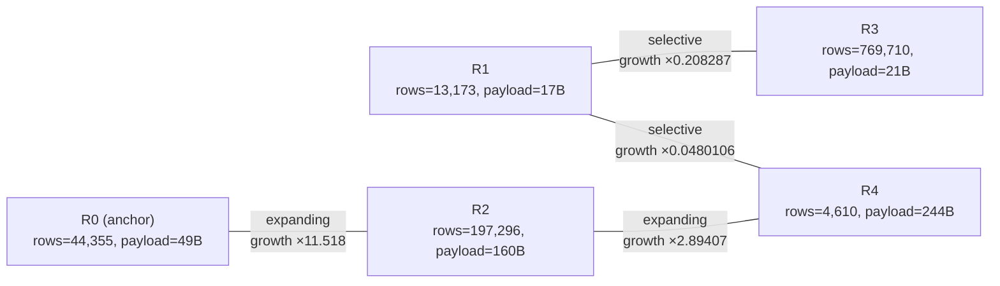

# Generated Join graph

This file is generated for quick inspection. `graph.json` remains the
authoritative machine-readable graph.

## Edge details

For each endpoint, `D` is its key NDV and `M = rows / D` is its
average key multiplicity. `q` is the effective fraction of the
smaller key set that matches the other endpoint. The logical
selectivity is `q / max(D_left, D_right)`.

| Edge | Direction | Role | Growth | Left `D` | Left `M` | Right `D` | Right `M` | Overlap `q` | Selectivity |
| --- | --- | --- | ---: | ---: | ---: | ---: | ---: | ---: | ---: |
| R0 -- R2 | R0 → R2 | `expanding` | 11.518 | 3,766 | 11.7777 | 3,766 | 52.3887 | 0.219857 | 5.83795e-05 |
| R1 -- R3 | R1 → R3 | `selective` | 0.208287 | 13,172 | 1.00008 | 666,513 | 1.15483 | 0.180362 | 2.70605e-07 |
| R1 -- R4 | R4 → R1 | `selective` | 0.0480106 | 13,172 | 1.00008 | 4,609 | 1.00022 | 0.048007 | 3.64462e-06 |
| R2 -- R4 | R2 → R4 | `expanding` | 2.89407 | 843 | 234.04 | 843 | 5.46856 | 0.52922 | 0.000627782 |
