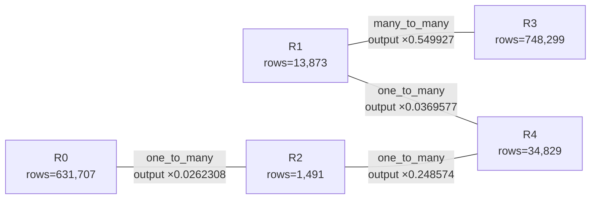

# Generated Join graph

This file is generated for quick inspection. `graph.json` remains the
authoritative machine-readable graph.

## Edge details

For each endpoint, `D` is its key NDV and `M = rows / D` is its
average key multiplicity. `q` is the effective fraction of the
smaller key set that matches the other endpoint. The logical
selectivity is `q / max(D_left, D_right)`.

| Edge | Type | Left `D` | Left `M` | Right `D` | Right `M` | Overlap `q` | Selectivity | Output factor |
| --- | --- | ---: | ---: | ---: | ---: | ---: | ---: | ---: |
| R0 -- R2 | `one_to_many` | 928 | 680.719 | 1,491 | 1 | 0.0262308 | 1.75928e-05 | 0.0262308 |
| R1 -- R3 | `many_to_many` | 3,580 | 3.87514 | 2,751 | 272.01 | 0.141911 | 3.96401e-05 | 0.549927 |
| R1 -- R4 | `one_to_many` | 13,873 | 1 | 11,857 | 2.93742 | 0.0369577 | 2.664e-06 | 0.0369577 |
| R2 -- R4 | `one_to_many` | 1,491 | 1 | 225 | 154.796 | 0.248574 | 0.000166716 | 0.248574 |
